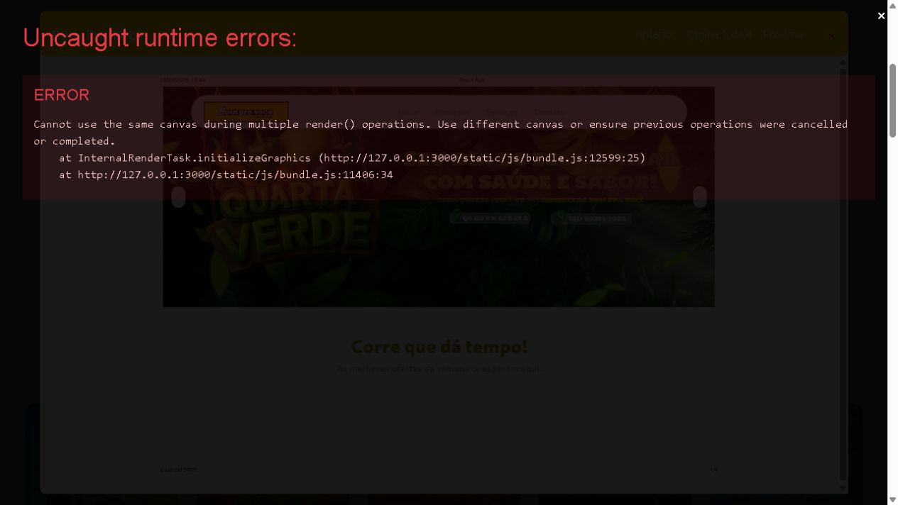
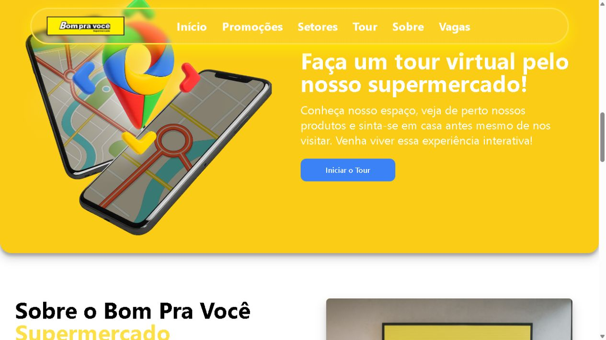
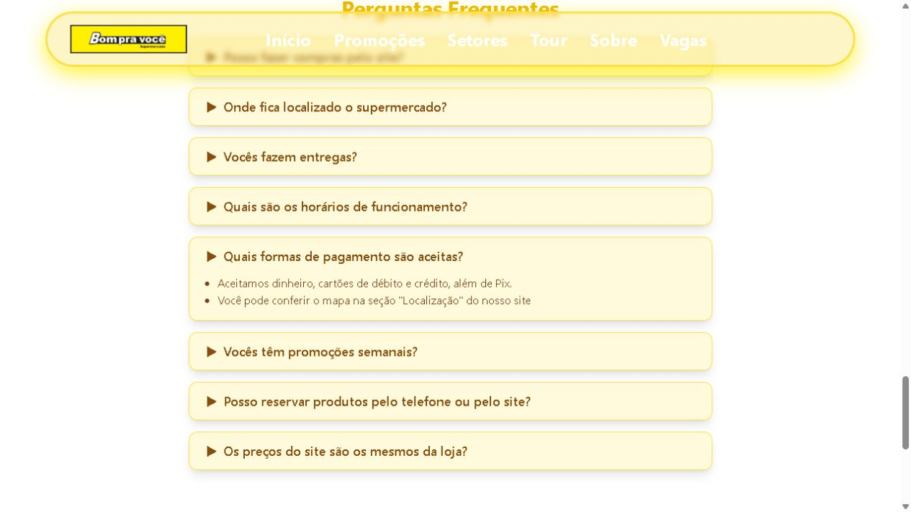
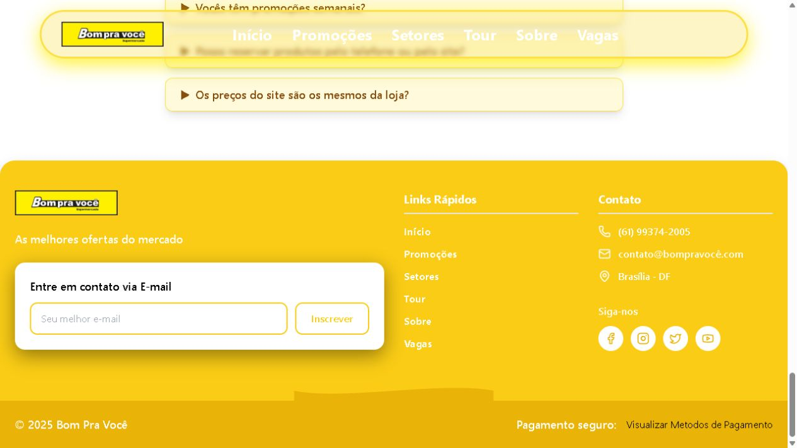
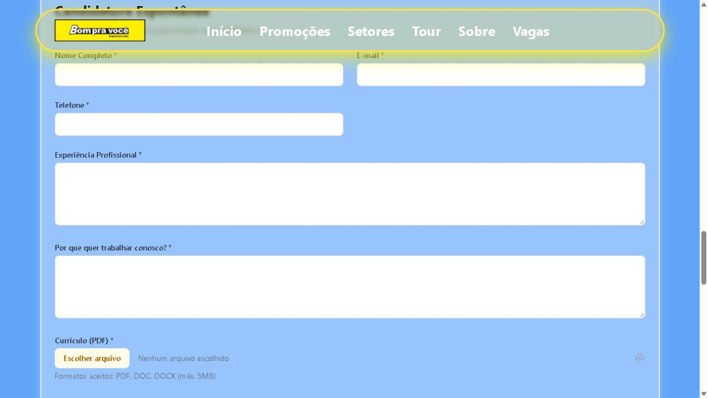
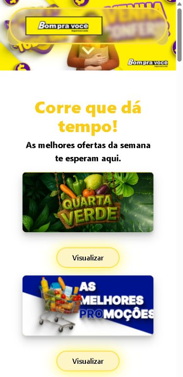
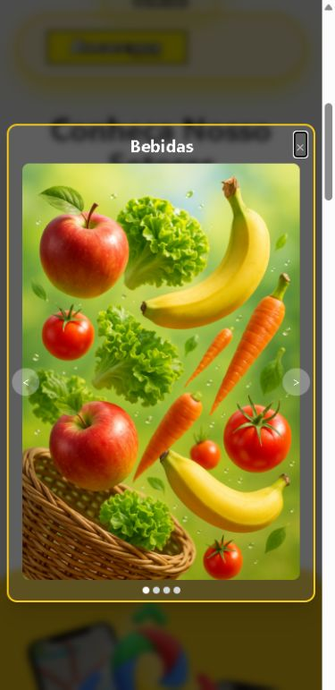

# Percurso visual — Bom Pra Você

Complemento da [auditoria e plano de prioridades](AUDITORIA-SITE-2026-09-30.md), executado em 30/09/2026, no fuso America/Sao_Paulo. Ambiente: versão local do repositório, `http://127.0.0.1:3000`, React em modo de desenvolvimento. Todas as imagens foram capturadas, salvas e inspecionadas nesta auditoria. Não são mockups de uma proposta.

## 1. Entrada e orientação — parcial

**Funciona:** marca e campanha visual reconhecíveis; menu de seções no desktop; ofertas aparecem logo depois do banner.

**Problemas:** não há atalhos para pagamentos, localização ou FAQ. Endereço e telefone da campanha aparecem dentro da imagem; precisam também ser apresentados em texto e ações acessíveis. O texto alternativo “aa” não descreve o conteúdo. Banner gira automaticamente sem pausa.

**Recomendação:** primeira tela com identificação da loja, horário e acesso claro a “Ver ofertas” e “Como chegar”. Achados A04, A05, A12.

## 2. Consultar tabloide — falha no ambiente local

Ao clicar no primeiro “Visualizar”, o modal foi criado; inicialmente mostrou “Página 1 de 0”. Em seguida o navegador registrou erro de renderizações concorrentes no mesmo canvas e exibiu a sobreposição de erro do ambiente de desenvolvimento. O material subjacente aparenta reproduzir uma página do próprio site, em vez de um tabloide convencional de produtos e preços; seu conteúdo completo não foi auditado.

Erro: `Cannot use the same canvas during multiple render() operations. Use different canvas or ensure previous operations were cancelled or completed.`

**Limite:** isso comprova falha na execução local observada, não comportamento de uma versão pública. Não foi possível validar leitura completa e paginação. O teste de Escape neste estado foi afetado pela sobreposição e não serve isoladamente como prova sobre o diálogo do PDF. O erro também está em [console.json](evidencias-auditoria-2026-09-30/console.json).

**Recomendação:** corrigir o visualizador e substituir o material de teste por campanhas aprovadas, com validade. Achados A03, A13, A18.

## 3. Iniciar tour — sem ação

O clique em “Iniciar o Tour” manteve a página e o mesmo conteúdo. A ausência de ação é confirmada pelo código. A imagem ilustra mapas, mas não fornece uma rota até a loja.

**Acessibilidade:** branco `#FFFFFF` sobre amarelo `#FACC15` medido no título produz contraste aproximado de 1,53:1, insuficiente para esse texto. A barra superior também perde legibilidade sobre o fundo amarelo; o contraste dessa composição transparente não foi medido.

**Recomendação:** priorizar localização real e fotos da loja; tour depende de decisão e implementação posterior. Achados A07, A14.

## 4. Tirar dúvida de pagamento — interação funciona, conteúdo incompleto

O FAQ expandiu a resposta corretamente. O navegador expõe estado expandido/recolhido, um ponto positivo do uso de `details/summary`.

A resposta lista dinheiro, débito, crédito e Pix, mas não identifica bandeiras, vales ou condições. A segunda frase trata de mapa, sem relação com pagamento. A seção “Localização” citada não está montada. A barra fixa encobre parte do topo da seção na posição observada.

**Recomendação:** seção própria de pagamentos com informações confirmadas e resumo consistente no FAQ. Achados A02, A04, A10, A19.

## 5. Contato, links e pagamentos no rodapé — incompleto

O botão “Visualizar Metodos de Pagamento” foi clicado sem abrir conteúdo ou diálogo. O código confirma ausência de ação. Há telefone e e-mail visíveis, mas sem links de contato. Redes sociais apontam para `#`; links de seções usam destinos inconsistentes. Não houve envio de e-mail ou inscrição durante a auditoria.

**Acessibilidade:** texto branco sobre amarelo prejudica leitura; o campo de inscrição depende de placeholder e mistura “contato” com “inscrição”.

**Recomendação:** canais reais, links funcionais e pagamentos visíveis; definir se existe necessidade de assinatura de promoções. Achados A02, A06, A08, A14.

## 6. Candidatura — formulário acessível, recebimento não implementado

“Candidatura Espontânea” abre o formulário. Rótulos estão associados aos campos. A barra fixa cobre o título nessa posição. Não foram preenchidos dados pessoais, anexados currículos ou enviados formulários.

O falso sucesso foi identificado por inspeção do código: callback apenas registra os dados no console, exibe alerta e troca a visualização. Não foi validado por um envio real. O texto promete máximo de 5 MB, mas `handleFileChange` apenas armazena o primeiro arquivo, sem validar tamanho.

**Recomendação:** retirar o fluxo da primeira publicação ou definir recebimento real e tratamento de dados antes de ativá-lo. Achados A01, A15, A19.

## 7. Navegação em celular — falha de orientação

Teste com viewport 390 × 844. O menu desaparece e sobra apenas a marca na barra fixa, que cobre boa parte do banner. As ofertas se empilham, mas as chamadas “Visualizar” não distinguem as campanhas pelo nome do botão.

**Ponto positivo:** não houve rolagem horizontal na página nesse estado: `clientWidth` e `scrollWidth` foram 375 px, com viewport de 390 px incluindo a barra de rolagem. Isso não comprova todos os estados ou dispositivos.

**Recomendação:** navegação móvel, informação principal em texto e banner adequado ao espaço restante. Achados A05, A12, A19.

## 8. Explorar setor — conteúdo incorreto e falha de teclado

Ao abrir “Bebidas” no layout móvel, a galeria mostrou frutas e verduras sob esse título. Escape não fechou o modal; o botão de fechar continuou visível. O fechamento por clique funcionou depois. Os pontos de navegação são botões sem nome na árvore de acessibilidade.

**Recomendação:** fotos do setor correto, rótulos dos controles, gestão de foco e fechamento por Escape. Não basta existir uma galeria se ela acrescenta informação equivocada. Achados A09, A13.

## Alcance e verificações realizadas

- Dependências instaladas conforme o lockfile, sem atualização deliberada de versões; scripts de instalação desativados. As primeiras tentativas falharam por configuração/permissão do ambiente; a instalação posterior concluiu.
- Compilação de desenvolvimento concluída com sucesso. Abertura de site, tabloide, tour, FAQ, formulário, botão de pagamentos e galeria verificados conforme os limites acima.
- Código e conteúdo do site preservados; documentos, capturas e registro de erro são os artefatos desta entrega. Dependências e cache de desenvolvimento foram gerados localmente em pastas ignoradas/temporárias.
- Não executados: build de produção, suite automatizada, Lighthouse, auditoria completa de dependências/segurança, leitor de tela, todos os navegadores, todos os breakpoints e confirmação operacional da loja.
- As referências externas e critérios de aceite estão no relatório principal. Nenhuma nota numérica de desempenho ou conformidade foi inferida.

**Próximo passo proposto:** aprovar o escopo da primeira versão e confirmar dados comerciais antes de implementar. O relatório não autoriza alterações no site.
