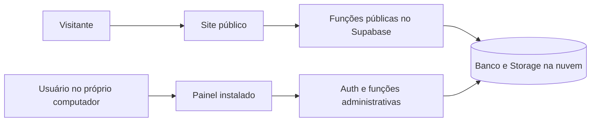

# Plano consolidado — site, Supabase e painel local

Revisão de execução de 03/10/2026: [plano detalhado de panfletos e currículos no Supabase](PLANO-EXECUCAO-SUPABASE-2026-10-03.md), com inventário remoto de leitura, diferenças do frontend atual, ordem de implementação e critérios de aceite.

Decisão de 01/10/2026: **adotar painel instalado somente no computador do usuário**. Aprovação de arquitetura e documentação; implementação, instalação e publicação ainda não executadas nem autorizadas por esta consolidação.

Este é o ponto de entrada do planejamento. Substitui a proposta de painel web nas comparações anteriores de hospedagem. Os detalhes complementares permanecem nos planos de [site](PLANO-FRONTEND-CORRECOES-AUDITORIA-2026-10-01.md), [Supabase](PLANO-SUPABASE-DADOS-CURRICULOS-FUNCOES-2026-10-01.md) e [painel local](ALTERNATIVA-PAINEL-LOCAL-SUPABASE-2026-10-01.md). O nome histórico do último arquivo foi preservado para manter os links; a opção já foi adotada.

## Responsabilidades definitivas

Progresso de 01/10/2026: [correções do site público implementadas e verificadas localmente](IMPLEMENTACAO-SITE-PUBLICO-2026-10-01.md). Backend e painel local seguem pendentes. A autorização posterior do usuário cobriu esta implementação do site; não houve publicação.

| Parte | Entrega planejada |
|---|---|
| Site público | Landing page informativa, ofertas vigentes, localização, horários, pagamentos, FAQ e envio de currículo com comprovante. Sem administração, cadastro de candidato ou consulta por protocolo. |
| Supabase na nuvem | Fonte oficial de dados e arquivos, login administrativo, autorização, funções de publicação e recebimento, protocolo único, auditoria, quarentena e manutenção. |
| Painel local | Aplicativo independente no computador do usuário, com login e duas áreas: Panfletos e Currículos. Sem servidor público, banco de currículos local ou sincronização offline no MVP. |

Não existe chamada do site ao computador. O painel faz conexões HTTPS de saída; não exige portas abertas no roteador. Computador desligado não interrompe recebimento de currículos nem ofertas. Supabase e hospedagem continuam sendo dependências online.

## Organização futura do código

- `bom-pra-voce-novo/`: preservar aplicação pública e corrigir A01–A19. Rotas públicas `/`, `/trabalhe-conosco`, `/privacidade` e página de não encontrado. Não criar rotas `/admin/*`.
- `painel-local/`: projeto separado a criar somente na implementação. Telas de login, campanhas, editor/prévia e currículos; serviços administrativos, sessão e integração com sistema operacional próprios. Não embutir esse projeto no build do site.
- `supabase/`: migrações, funções e testes de autorização. Serviços públicos `public-promotions`, `application-init`, `application-submit`; serviços autenticados `promotion-admin` e `rh-applications`.
- Compartilhar contratos e validações puras quando útil; permissões e validação de segurança sempre no servidor. Nenhum segredo compartilhado com aplicativos clientes.

Tecnologia desktop ainda requer decisão técnica antes de criar o projeto. Confirmar sistema operacional/versão e escolher runtime, instalação e atualização com documentação vigente. Essa escolha não reabre a decisão já tomada de painel local. Não adicionar integração com PDV.

## Fluxos do painel

**Panfletos:** entrar → listar campanhas → adicionar/substituir → selecionar arquivo → conferir prévia, título e validade → publicar → aguardar confirmação remota → conferir no site. Orientar imagem vertical 1080 × 1350 px, PDF A4, proporção preservada; metas 1 MB/imagem e 5 MB/PDF, teto de 10.000.000 bytes. Sem cortes automáticos de preços. Falha mantém versão anterior; retirada é explícita e confirmada.

**Currículos:** entrar → verificar permissão → listar recebimentos paginados → abrir detalhes mínimos → baixar arquivo liberado pela inspeção. Não baixar todos automaticamente, nem exibir arquivo em quarentena como seguro. Download é ação explícita e deixa cópia local cuja guarda/descarte precisa ser definida. Não haverá ranking ou avaliação automática.

O mesmo usuário pode receber ambas as permissões por concessão administrativa; uma conta autenticada não ganha acesso automaticamente. Sem cadastro público administrativo. Recuperação de conta e MFA devem funcionar mesmo se o computador precisar ser substituído.

## Regras que não mudam

- Comprovante nasce da confirmação do arquivo e da transação de recebimento; repetição segura não gera nova candidatura. Falha de impressão não exige reenvio.
- Protocolo não permite consulta pública ou download. Currículos permanecem privados.
- Chave publicável no site/painel quando necessária; chave secreta e senha de banco nunca no executável. Sessão persistente somente com proteção apropriada do sistema operacional; caso não disponível, exigir novo login.
- Sem internet, painel informa indisponibilidade e não promete publicação. Não criar fila offline no MVP.
- Retenção, inspeção, limpeza e backups rodam na nuvem/infraestrutura operacional, independentes do painel. Backups abrangem banco e arquivos, com restauração testada.
- Horários, pagamentos e outros textos institucionais continuam em configuração versionada do site; o painel inicial gerencia apenas panfletos e currículos.

## Sequência única de implementação

| Fase | Entrega | Aceite |
|---|---|---|
| C0 — preparação | Inventário de leitura do projeto “bom pra voce”, conteúdo comercial, SO do computador e escolha do runtime/atualização | Projeto correto identificado; contratos e decisões registrados; sem mudanças remotas implícitas |
| C1 — fundação | Dados, constraints, funções, Storage e permissões em ambiente de teste | Visitante/conta sem permissão não acessam currículo; arquivos fictícios e testes reais de autorização |
| C2 — site | Correções A01–A19, consulta de campanhas, candidatura e comprovante | Jornadas móvel/teclado, expiração e falhas testadas; nenhuma confirmação fictícia |
| C3 — painel | Login, sessão, Panfletos e Currículos | Publicação só após confirmação, downloads autorizados, revogação e falhas de rede tratadas |
| C4 — distribuição | Instalador, configuração do projeto, atualização e recuperação | Instalar no computador alvo; atualizar sem perder configuração; versão anterior compatível ou bloqueio orientado |
| C5 — operação | Privacidade, scanner, retenção, backups e manual | Restauração de dados e arquivos; conta recuperável; cópias locais e quarentena tratadas |
| C6 — homologação e liberação | Integração remota e publicação mediante autorização própria | Site recebe com PC desligado; panfleto publicado aparece corretamente; currículo privado e recibo consistentes |

C2 informativo pode avançar em paralelo à fundação após autorização de implementação. Conclusão das integrações exige backend real; mocks não comprovam operação. As fases F do plano frontend detalham C2/C3, sem criar uma segunda administração web.

## Distribuição e manutenção do painel

Planejar instalador para o SO confirmado, origem de distribuição confiável e verificação de integridade/autenticidade. Começar com atualização manual orientada é suficiente para um computador; atualização automática só se escolhida e protegida. Definir assinatura e eventual custo antes da distribuição. Nenhum atualizador deve executar pacote obtido de endereço arbitrário.

Versões das funções devem manter compatibilidade durante atualização ou rejeitar cliente antigo com instrução clara. Não incluir currículos, tokens ou segredos em pacote, logs e relatórios de erro. Desinstalação e logout devem tratar sessão/cache sem remover silenciosamente arquivos que o usuário baixou.

## Validação e pendências

Testar instalador/atualização no computador alvo, login/MFA/recuperação, logout e sessão revogada, publicação interrompida, repetição após resposta perdida, permissões por API direta, tentativa de abrir currículo privado e operação pública com painel fechado. Duas instâncias do painel não podem causar sobrescrita silenciosa.

Pendências para implementação/operação: SO e runtime, projeto Supabase verificado, contas autorizadas, scanner, retenção/privacidade, destino e política de backup, dados comerciais, domínio e distribuição do instalador. Não são pendências da decisão arquitetural: o painel local já foi escolhido.

Situação: documentação consolidada; código, Supabase, instalador e publicação não alterados. Custos anteriores de hospedagem continuam estimativas históricas a conferir na contratação; painel local não elimina nuvem ou domínio.
