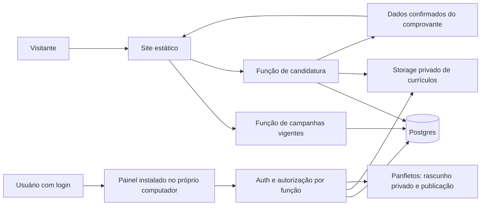

# Plano de implementação — Supabase, dados, currículos e funções

Data: 01/10/2026. Status: **planejamento; implementação e alterações remotas não autorizadas**.

Referências do projeto: [auditoria](AUDITORIA-SITE-2026-09-30.md) e [arquitetura/custos](HOSPEDAGEM-E-RECEBIMENTO-DE-ARQUIVOS-2026-10-01.md). Este documento detalha o caminho Supabase e substitui as alternativas genéricas como orientação para a próxima implementação.

Arquitetura adotada: [plano consolidado do site, Supabase e painel local](PLANO-CONSOLIDADO-SITE-SUPABASE-PAINEL-LOCAL.md). A administração fica somente no aplicativo do computador do usuário; o site não depende dele para operar.

## 1. Resultado esperado

Complemento: [plano do frontend e correções da auditoria](PLANO-FRONTEND-CORRECOES-AUDITORIA-2026-10-01.md), com componentes, rotas, integração, fases e testes de aceite.

- Funcionário autorizado consegue adicionar, substituir e retirar panfletos, com prévia e instruções de tamanho/formato.
- Visitante vê somente campanhas publicadas e vigentes.
- Candidato envia currículo em PDF e recebe comprovante com protocolo único somente após persistência confirmada.
- Não existe cadastro de candidato, consulta pública por protocolo, acompanhamento de seleção ou acesso público ao currículo.
- Responsável pelo RH consegue acessar os recebimentos em aplicativo local restrito.
- Falhas de rede, upload, banco e geração do comprovante têm recuperação definida e não produzem sucesso falso ou duplicidade.

Fora do escopo: checkout, pagamentos online, integração com PDV, seleção automática de candidatos, envio de mensagens, e-mail transacional e publicação do site. Os meios de pagamento da loja continuam sendo conteúdo informativo, sem integração financeira.

## 2. Evidências atuais e limite da conexão

Atualização posterior: na implementação do site, a conexão passou a estar disponível. Leitura confirmou o projeto `jcyffbjsvwkmzgvilxha` (Bom pra voce), sem tabelas no schema public e sem Edge Functions listadas. Outros schemas, Storage e Auth ainda não foram inventariados. Ver [relatório e contratos públicos do frontend](IMPLEMENTACAO-SITE-PUBLICO-2026-10-01.md); incorporar campo summary de campanha, contrato de inicialização idempotente e headers antes de implementar as funções. O relato abaixo preserva a limitação encontrada durante o planejamento anterior.

Verificado nesta etapa:

- `bom-pra-voce-novo/package.json`: React 19 e react-scripts; sem cliente Supabase declarado.
- `src/Data/TabloideData.js`: dois itens fixos apontam ao mesmo PDF de teste.
- `src/Components/WorkWithUs/TrabalheConosco.jsx`: callback usa console e alerta de sucesso, sem persistência.
- Inspeção do Git: documentação ainda não rastreada; nenhum código alterado nesta etapa.
- Nenhum arquivo de integração Supabase localizado na listagem pesquisada, excluindo dependências.

O usuário informou que conectou o Supabase e confirmou o nome do projeto: **“bom pra voce”**. Entretanto, o catálogo de ferramentas disponível nesta sessão não expôs operações desse serviço. **Não foi possível verificar remotamente o identificador, organização, região, plano, tabelas, políticas, buckets, usuários ou funções.** Isso não significa que a conexão do usuário falhou. O nome é informação fornecida pelo usuário, não resultado de inventário remoto; não solicitar segredos pelo chat.

Antes de implementar, inspecionar em modo de leitura o projeto explicitamente destinado ao Bom Pra Você. Não selecionar projetos de outros sistemas por semelhança ou por estarem abertos no navegador. Inventariar recursos existentes e preservar dados; migrações devem ser aditivas e revisáveis.

## 3. Arquitetura mínima

Cloudflare Pages entrega somente o site público; o painel é instalado separadamente e faz conexões HTTPS de saída; Supabase concentra Auth, banco, Storage e Edge Functions. Evitar servidor separado e segundo provedor de funções sem necessidade comprovada. Manter dados de produção fora de ambientes de teste; usar instância local ou projeto de homologação com arquivos fictícios.

## 4. Modelo de dados proposto

Nomes orientativos para migrações futuras, não tabelas já criadas. Dados internos em schema não exposto pela Data API; eventuais tabelas expostas usam RLS e concessões mínimas. Funções SQL privilegiadas não podem ser chamadas por `anon`/usuários comuns.

| Entidade | Campos essenciais | Restrições e finalidade |
|---|---|---|
| `staff_permissions` | `user_id` → Auth, `permission`, `enabled`, timestamps | Chave única usuário/permissão. Permissões concedidas por responsável; não editáveis pelo próprio usuário |
| `promotion_campaigns` | UUID, título, condições, início/fim `timestamptz`, estado, versão atual, revisão, autor | Fim maior que início; estados draft/published/withdrawn. Expiração calculada no servidor, sem depender de alteração de estado por cron |
| `promotion_versions` | UUID, campanha, número da versão, caminhos de arquivo/miniatura, MIME, bytes, hash, autor, validação | Versão imutável e única por campanha; caminho único. Publicar somente versão validada e vinculada à própria campanha |
| `application_intents` | UUID, hash do token temporário, chave de idempotência, hash da requisição, expiração, estado, caminho reservado | Sem informações pessoais antes de serem necessárias; unicidade de idempotência. Controla envio e repetição, não é cadastro do candidato |
| `applications` | UUID, intent único, nome, contato, área/vaga opcional, `received_at`, `delete_after`, versão do aviso de privacidade | Contato mínimo necessário; limites de comprimento; prazo de guarda configurado antes da abertura pública. Sem CPF/RG ou dados sensíveis solicitados |
| `application_files` | UUID, candidatura única, bucket/caminho único, nome sanitizado, MIME confirmado, bytes, SHA-256, estado de inspeção | Um PDF por candidatura no MVP; hash calculado a partir do objeto efetivamente persistido |
| `application_receipts` | candidatura única, protocolo único, instante de emissão, versão do modelo, snapshot mínimo | Criado na mesma transação de finalização da candidatura. Número gerado no servidor; não é credencial de acesso |
| `audit_events` | UUID, ator/serviço, ação, referência interna, instante, resultado | Apenas serviço grava; não guardar conteúdo de currículo, tokens, contatos ou payload integral |
| `maintenance_jobs` | tipo, alvo, estado, tentativas, próximo processamento | Exclusão e limpeza retomáveis. Não depender de execução única ou memória de uma função |
| `rate_limit_windows` | chave efêmera pseudonimizada, janela, contador, expiração | Incremento atômico compartilhado entre instâncias; limpeza periódica. Não usar contador apenas em memória |

Datas armazenadas em UTC e exibidas em America/Sao_Paulo. Campo “área de interesse” permite candidatura espontânea sem manter catálogo fictício de vagas; IDs de vagas só serão aceitos quando houver fonte real aprovada. Snapshot do recibo contém somente o necessário e acompanha a exclusão dos dados pessoais.

## 5. Arquivos e autorização

| Bucket proposto | Visibilidade | Gravação | Leitura |
|---|---|---|---|
| `promotion-drafts` | Privado | Serviço após autenticar editor; upload limitado ao caminho reservado | Editor autorizado, para prévia |
| `promotion-public` | Público, somente material aprovado | Serviço de publicação | Visitantes conhecendo a URL; arquivos já publicados não podem ter sigilo garantido depois |
| `resumes-private` | Privado desde a criação | Função de recebimento; sem gravação anônima direta | RH autorizado, apenas arquivos liberados pela inspeção |

Não usar nome, telefone ou e-mail em caminhos. Não sobrescrever arquivos recebidos. Remover objetos pela API de Storage, não apagando apenas metadados via SQL.

Papéis operacionais:

- **Editor de promoções:** gerencia campanhas; não acessa currículos.
- **RH:** lista recebimentos e baixa anexos liberados; não publica promoções por padrão.
- **Gestor de acessos:** concede/revoga permissões; isso não concede automaticamente leitura de currículo. Pode receber permissão RH separadamente.
- **Visitante:** lê campanha vigente e inicia seu próprio envio; não lê tabelas, lista arquivos nem pesquisa protocolo.

Login interno por convite; desativar cadastro público de funcionários. Validar JWT e permissão ativa em cada operação. Não confiar em papel enviado pelo frontend ou em metadados alteráveis pelo usuário. Contas individuais e MFA para acesso interno; testar recuperação/revogação. Rotas escondidas e CORS não substituem autorização.

Chave pública/publishable pode existir no frontend quando necessária, mas não concede acesso administrativo. Chave secreta/service-role somente em ambiente de função, nunca no executável local, em `REACT_APP_*`, repositório, comprovante ou logs. O acesso privilegiado ignora RLS e exige checagem explícita de permissões antes da operação.

## 6. Contratos das funções

Os nomes representam responsabilidades; operações administrativas relacionadas podem compartilhar uma Edge Function com roteamento, sem criar dezenas de serviços.

| Operação | Quem chama | Entrada e resultado | Regras |
|---|---|---|---|
| `public-promotions` GET | Visitante | Lista permitida de título, condições, validade, mídia e hora do servidor | Apenas `published` e início ≤ agora < fim. Sem rascunhos, autores ou campos internos |
| `application-init` POST | Visitante | Desafio antiabuso + chave aleatória de idempotência → intent e token efêmero | Token de alta entropia, armazenado apenas como hash. Sem resposta consultável por protocolo |
| `application-submit` POST | Visitante com token de intent | Multipart: dados mínimos e PDF → dados confirmados do comprovante | Validar limite, autorização do intent e persistência. Repetição idêntica retorna o mesmo protocolo durante janela temporária |
| `promotion-admin` | Editor autenticado | Preparar upload, validar, publicar, substituir, retirar | Controle otimista de revisão; conflito retorna 409, sem apagar a edição concorrente |
| `rh-applications` | RH autenticado | Listagem paginada mínima e download autorizado | Sem cache compartilhado; download autorizado por arquivo, logs de acesso sem PII |
| `maintenance` | Agendamento interno autenticado | Lotes de tarefas → resultados/reagendamento | Nunca endpoint aberto; permissões de serviço restritas, idempotência e limites por lote |

Proposta inicial para currículo: enviar PDF de até **5.000.000 bytes** pela função em multipart, evitando liberar upload anônimo direto no Storage. A função transmite para caminho privado reservado. Validar o suporte ao corpo, memória, tempo e inspeção no ambiente real antes de confirmar esse desenho. Se necessário, usar upload direto assinado **apenas para staging** e promover cópia validada para caminho final imutável; não emitir comprovante de arquivo que ainda possa ser substituído por credencial de upload vigente.

Erros previstos: 400 campos inválidos; 401 sessão/token inválido; 403 sem permissão; 409 reutilização da chave com outro conteúdo ou conflito de revisão; 413 arquivo grande; 415 tipo não aceito; 429 excesso; 503 dependência indisponível. Não devolver detalhes SQL, nomes de buckets privados ou existência de protocolo a visitantes. Respostas pessoais e comprovantes usam `Cache-Control: no-store`.

## 7. Recebimento e protocolo — ordem das operações

1. Validar desafio antiabuso no servidor, limite global/por origem e disponibilidade operacional. Sem desafio válido, não abrir intent. Definir limites conservadores em configuração; ajustá-los com métricas, sem bloquear indiscriminadamente usuários de uma mesma rede.
2. Criar intent e token de sessão de envio com expiração proposta de 30 minutos. Prazo é escolha do projeto a validar, não limite presumido do Supabase. Guardar token apenas na memória da página; não em URL, analytics ou armazenamento persistente.
3. Validar campos, tamanho e conteúdo efetivo do PDF. Limitar leitura do corpo; nome/extensão/MIME do navegador não comprovam tipo. Rejeitar PDF ilegível/criptografado se não puder ser inspecionado. Não executar conteúdo do anexo.
4. Reservar processamento do intent com atualização atômica e prazo de bloqueio recuperável; envios concorrentes não podem finalizar duas vezes. Registrar hash do payload para rejeitar mesma chave com conteúdo diferente.
5. Persistir arquivo em Storage privado, verificar objeto final e hash. Estado de inspeção separado: pending/clean/rejected/error. Arquivos não liberados não podem ser baixados pelo RH.
6. Executar transação no Postgres: candidatura + arquivo + recibo + intent finalizado + evento. UUIDs, relações únicas e protocolo único impedem duplicidade; colisão de protocolo exige nova geração.
7. Após commit, devolver protocolo e dados do comprovante. A confirmação significa armazenamento recebido, não aprovação de segurança concluída ou leitura pelo RH. Inspeção antimalware pode continuar em quarentena; a tela deve distinguir recebimento de qualquer avaliação posterior.
8. Gerar PDF simples/texto imprimível no frontend a partir dessa resposta confirmada, escapando entradas. Falha ao gerar PDF permite tentar baixar novamente na sessão sem reenviar currículo. Não gerar imagem via serviço externo nem transmitir dados a outra ferramenta para montar o comprovante.

O protocolo pode seguir `BPV-<ano>-<componente aleatório>`, com no mínimo 128 bits aleatórios codificados e constraint única. UUID interno, protocolo exibido e token temporário são valores diferentes. Não derivar número de nome, CPF, telefone ou contador sequencial.

O recibo inclui nome da loja confirmado, nome do candidato, área opcional, protocolo, data/hora de recebimento, nome sanitizado do arquivo e aviso: “Confirma apenas o recebimento do currículo; não garante contratação. Não há consulta de andamento pelo site. Guarde este comprovante.” Não incluir URL de currículo, QR de consulta, contato completo ou segredo. PDF não será apresentado como documento com assinatura digital certificada.

**Sem consulta pública:** não haverá `GET /applications/:protocol`, busca por CPF/e-mail, recuperação pública ou portal de acompanhamento. Repetição autenticada pelo token da sessão só recupera o resultado do próprio envio durante a janela curta; não é consulta por número. Após expirar, não permitir reemissão anônima. Atendimento eventual é processo interno do RH.

## 8. Falhas, consistência e limpeza

| Falha | Resultado esperado |
|---|---|
| Storage falha antes da gravação | Nenhum comprovante; erro recuperável e formulário preservado na memória |
| Storage grava, banco falha | Sem sucesso. Arquivo órfão associado ao intent fica identificado para retentativa/limpeza |
| Banco confirma, resposta se perde | Repetição com mesmo intent/token/payload retorna recibo existente; não cria outro |
| Duas abas enviam ao mesmo tempo | Lock/constraints garantem uma finalização; outra recebe resultado existente ou processamento em andamento |
| PDF do comprovante falha | Candidatura continua recebida; tentar gerar novamente usando dados confirmados |
| Scanner indisponível | Anexo permanece privado e bloqueado para RH; alerta operacional, sem classificar como limpo |
| Exclusão de objeto falha | Estado deleting, acesso revogado e nova tentativa; não anunciar eliminação completa |
| Agendamento falha | Campanha expira pela consulta de tempo no servidor; limpeza é retomada no próximo lote |

Não há transação única entre Storage e banco. Definir máquina de estados, reconciliação e tarefas retomáveis. Proposta: intents expiram em 30 minutos; órfãos só entram em limpeza após margem de 24 horas e ausência de processamento ativo. Esses prazos são operacionais propostos; retenção de candidaturas é decisão separada da loja.

## 9. Gestão dos panfletos

Tela do painel local: campanha, título, arquivo, prévia, início/fim e botões Adicionar/Substituir/Retirar. Orientações junto ao upload: imagem vertical preferencial 1080 × 1350 px; PDF A4 aceito; preservar proporção; não cortar preços/condições; meta 1 MB por imagem e 5 MB por PDF, teto proposto **10.000.000 bytes**.

Substituição: subir novo arquivo privado → validar e conferir prévia → copiar material aprovado para caminho público novo → transação muda ponteiro/versão da campanha. Manter anterior se qualquer passo falhar; coletar cópias órfãs depois. Retirada/expiração tira a campanha da listagem, mas não garante apagar cópias públicas já distribuídas.

`public-promotions` usa relógio do banco e projeção explícita de campos. No MVP, resposta sem cache compartilhado; arquivos de versões podem ter cache longo por serem imutáveis. Página aberta deve atualizar na expiração usando a hora retornada pelo servidor e recarregar ao recuperar foco. Se não conseguir validar vigência, não manter oferta antiga indefinidamente como atual. Não usar PDF de teste como fallback silencioso em produção.

## 10. Integração com o código existente

| Local | Alteração futura |
|---|---|
| `src/Data/TabloideData.js` | Substituir fonte fixa por serviço de campanhas; separar fixtures de teste |
| `src/Components/Tabloide/Tabloide.jsx` | Estados carregando/vazio/erro, validade visível e seleção da versão correta |
| `src/Components/Tabloide/TabloideView.jsx` | Resolver erro de renderização já documentado; download/abertura acessível de fallback |
| `src/Components/WorkWithUs/CandidaturaForm.jsx` | Simplificar campos, PDF/limite, envio real, erro recuperável e resultado com comprovante |
| `src/Components/WorkWithUs/TrabalheConosco.jsx` | Remover console com dados pessoais e sucesso simulado; não mostrar vagas fictícias |
| `src/Routes.jsx` | Somente páginas públicas e candidatura; sem administração nem consulta de protocolo |
| Novo `painel-local/` | Login, panfletos, RH e serviços autenticados; build e instalador independentes |
| Novos serviços locais | Cliente Supabase, contratos de funções, geração de comprovante e tratamento consistente de erros |
| Novo `supabase/` | Migrações, funções, configuração e testes versionados; segredos fora do Git |

Não redesenhar toda a landing page nesta entrega técnica. Correções gerais da auditoria continuam em escopo separado, exceto as necessárias à utilização segura destes fluxos.

## 11. Operação, privacidade e recuperação

- Confirmar responsável RH, política de retenção, finalidade/base legal, aviso ao candidato e atendimento de solicitações antes de abrir recebimento público. Não inventar prazo legal universal nem tornar consentimento genérico obrigatório por conveniência.
- Scanner/validação de conteúdo: escolher solução compatível com tamanho, confidencialidade, custo e limites das Edge Functions. Não enviar currículo para scanner público. Ausência dessa decisão impede liberação automática de anexos ao RH; recebimento em quarentena deve ser explícito.
- Limpeza elimina anexos, dados pessoais e snapshots de recibos conforme política aprovada. Tombstones mínimos para exclusão/restauração não devem copiar PII; restaurar backup deve reaplicar exclusões pendentes antes de reabrir acesso.
- Backup inclui banco **e objetos**, com manifesto e teste de restauração. O backup do banco Supabase não contém os arquivos Storage. Destino, frequência, criptografia, retenção e custo da cópia precisam ser definidos.
- Métricas sem PII: tentativas, recebimentos confirmados, falhas por etapa, bytes, fila em quarentena e atraso de limpeza. Alertas para falhas persistentes e limite de armazenamento/custo; não logar corpo multipart, contatos, tokens ou URLs assinadas.
- Nenhum serviço pode prometer “pronto em produção” com apenas migração aplicada ou teste local. Confirmar projeto, segredos, domínio permitido, permissões, restauração e testes remotos antes da liberação.

## 12. Etapas de implementação e entregáveis

1. **Inventário somente leitura:** identificar projeto; listar schemas, extensões, buckets, políticas, funções, Auth e plano/região. Produzir diagnóstico de diferenças antes de aplicar qualquer migração.
2. **Fundação local:** migrações aditivas, constraints, papéis/RLS, buckets e dados fictícios. Cliente/configuração com segredos separados. Testes de autorização no Postgres real/local Supabase.
3. **Recebimento:** intents, upload, finalização transacional, idempotência, protocolo, erros e quarentena. Testes de interrupção em cada fronteira Storage/banco/resposta.
4. **Comprovante e formulário:** remover sucesso falso, mostrar resultado confirmado, baixar/imprimir. Testar no celular, teclado e sem dados pessoais reais.
5. **Painel local de panfletos:** autenticação, permissões, prévia, publicação atômica por versão, validade e consulta pública.
6. **RH no painel local e operação na nuvem:** listagem mínima, download autorizado, inspeção, limpeza, retenção, backup e restauração. Sem ferramenta de avaliação automática de pessoas.
7. **Homologação remota autorizada:** aplicar migrações revisadas no projeto correto, configurar funções/segredos e testar com arquivos fictícios. Separar configuração de publicação pública.
8. **Liberação autorizada:** remover fixtures, validar dados comerciais/privacidade, monitorar primeiro recebimento controlado, entregar manual de atualização e recuperação.

Cada etapa atualiza esta documentação com implementado/testado/pendente e evidências. Não definir prazo em dias sem inventário remoto e decisão sobre inspeção/backup.

## 13. Testes de aceite obrigatórios

- Visitante e editor de promoções não listam/leem/alteram currículo nem por API direta; usuário autenticado sem permissão continua bloqueado.
- Usuário não se promove a RH/editor; conta revogada perde capacidade de emitir novos downloads. URLs temporárias, se usadas, têm expiração curta e seu risco residual documentado.
- Arquivo acima do limite, falso PDF, arquivo criptografado não suportado e payload malformado são tratados sem sucesso falso.
- Envio repetido/concorrente com mesmo intent produz uma candidatura e um protocolo; mesma chave com conteúdo diferente falha.
- Timeout após commit recupera o mesmo recibo durante a janela válida; token expirado não consulta dados; protocolo sozinho não retorna informação.
- Comprovante só aparece após arquivo final persistido e transação confirmada, contendo data do servidor; scanner pendente não é mostrado como aprovação.
- Falha na geração do comprovante não pede novo envio de currículo.
- Campanha nova incompleta não substitui atual; edição concorrente gera conflito; retirada e validade funcionam com relógio do cliente alterado e cache testado.
- Nenhum dado pessoal ou segredo aparece no bundle, logs, URL pública, cache compartilhado ou ferramentas de analytics.
- Exclusão/limpeza pode ser repetida; restauração recupera registros e arquivos consistentes e respeita exclusões.
- Caminho completo no celular: escolher PDF → enviar → guardar comprovante; caminho do funcionário: login → substituir panfleto → verificar publicação.

## 14. Pendências que não impedem o plano

| Decisão/verificação | Quando precisa estar resolvida |
|---|---|
| Resolver ref do projeto “bom pra voce” e realizar inventário remoto | Antes de qualquer alteração no Supabase |
| Contas autorizadas e separação editor/RH | Antes de conceder acesso |
| Retenção e aviso de privacidade | Antes de abrir formulário público |
| Scanner e política de arquivos suspeitos | Antes de liberar download de anexos recebidos |
| Backup de arquivos e restauração | Antes de afirmar operação recuperável |
| Nome/dados reais da loja no comprovante | Antes de emitir comprovantes reais |
| Domínio e ambientes | Antes de CORS/redirects e publicação |

Escolhas padrão propostas: protocolo de recebimento, sem consulta pública; PDF de currículo até 5 MB decimais; comprovante na tela sem e-mail; painel mínimo; contas de funcionários por convite. São propostas documentadas, não configurações já aplicadas.

## 15. Fontes técnicas verificadas

Consultadas em 01/10/2026:

- [Supabase — autenticação de Edge Functions](https://supabase.com/docs/guides/functions/auth): diferenciar função pública e função de usuário/serviço; verificar autorização no handler quando aplicável.
- [Supabase — Storage e RLS](https://supabase.com/docs/guides/storage/security/access-control): políticas por operação e risco das chaves privilegiadas.
- [Supabase — limites de funções](https://supabase.com/docs/guides/functions/limits): validar runtime antes de escolher inspeção/conversão de arquivos.
- [Supabase — backups](https://supabase.com/docs/guides/platform/backups): arquivos Storage exigem estratégia complementar.

As fontes descrevem capacidades da plataforma, não comprovam configuração ou funcionamento da conta conectada. Sem migrações, funções ou código de produção criados nesta etapa.

